# A2 单词表

| 图片 | 单词 | 词性 | 释义 | 例句 | 近义词 | 反义词 |
| :----: | --- | ---- | ---- | ---- | ---- | ---- |
|  | gemelo | s., m. | 双胞胎 | Estos gemelos tienen los ojos claros. | mellizo | |
| 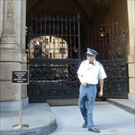 | portero | s., m. | 门卫 | El portero está delante de la puerta. | conserje, bedel | |
| 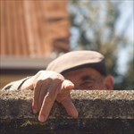 | vecino | s., m. | 邻居 | Todos los días me saluda mi vecino. | | |
|  | nervioso | adj., m. | 紧张的 | Mi hermano está muy nervioso cuando tiene un examen. | excitado, exaltado, inquieto | tranquilo, sereno |
| 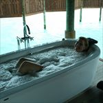 | bañera | s., f. | 浴缸 | La chica está dentro de la bañera con espuma. | | |
| 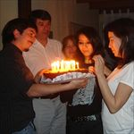 | invitado | s., m. | 客人 | Julia tiene cuatro invitados a su fiesta de cumpleaños. | | |
| 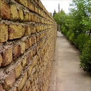 | pared | s., f. | 墙 | La pared es de ladrillos. | tabique, muro | |
|  | amueblado | adj., m. | 有家具的 | La habitación está amueblada: tiene una mesa, silla, estantes, etcétera. | | |
| 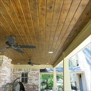 | techo | s., m. | 屋顶，天花板 | El techo de la casa es de madera. | cubierta, tejado | |
| 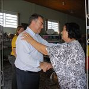 | visitar | v., tr. | 拜访，探望 | Juan visita a su madre cada semana. | saludar | |
| 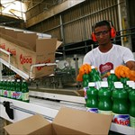 | fábrica | s., f. | 工厂 | El chico trabaja en una fábrica de productos de limpieza. | factoría, empresa | |
| 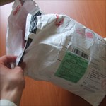 | pedido | s., m. | 订单 | A Pedro ya le ha llegado el pedido de camisetas. | encargo, petición, demanda | |
| 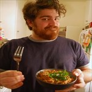 | generoso | adj., m. | 大方的 | Mateo es muy generoso y siempre me da a probar su comida. | desprendido | tacaño, egoísta |
| 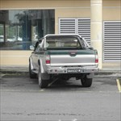 | egoísta | adj., m./f. | 自私的 | El dueño del coche es muy egoísta porque ha aparcado en dos lugares. | egocéntrico, tacaño | generoso, desprendido |
| 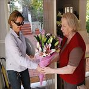 | regalar | v., tr. | 送礼物 | La mujer regala un ramo de flores a su madre. | obsequiar, dar | cobrar, vender |
|  | bote | s., m. | 瓶子 | Estos botes de colores no tienen nada dentro. | frasco, tarro | |
| 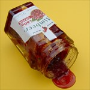 | mermelada | s., f. | 果酱 | A nosotros nos encanta la mermelada de frambuesa. | confitura | |
| 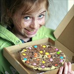 | goloso | adj., m. | 爱吃甜食的 | La niña es muy golosa. Siempre está comiendo chocolate. | | |
| 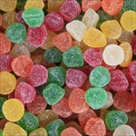 | dulce | s., m. | 糖果 | A los niños les vuelven locos los dulces. | chuchería | |
| 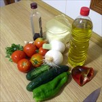 | ingrediente | s., m. | 成分，原料 | El tomate es uno de los ingredientes del gazpacho andaluz. | componente | |
|  | hambre | s., f. | 饥饿 | El perro espera la comida porque tiene hambre. | apetito | desgana |
| 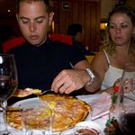 | hacerse la boca agua | expr. col. | 流口水 | A Violeta se le hace la boca agua al pensar en la pizza que va a comer. | | |
| 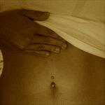 | estómago | s., m. | 肚子 | A Silvia le duele un poco el estómago. | | |
| 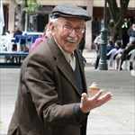 | anciano | s., m. | 老年人 | El anciano se divierte jugando a la peonza. | mayor, viejo, abuelo | joven |
| 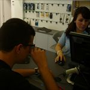 | cliente | s., m. | 顾客 | La chica atiende al cliente rápidamente. | | |
| 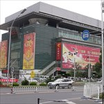 | grandes almacenes | s., m. | 百货公司 | El Mercado de la Seda son los grandes almacenes más conocidos de Pekín. | | |
|  | en efectivo | expr. | 现金支付 | Yo siempre pago mis compras en efectivo. | en metálico | con tarjeta |
|  | traer | v., tr. | 带来 | El camarero nos trae las bebidas a la mesa. | aproximar, acercar | llevar, alejar |
| 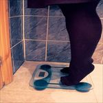 | pesar | v., intr. | 称重 | La chica pesa 75 kilos. | | |
| 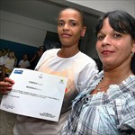 | certificado | s., m. | 证书 | La chica muestra su certificado de finalización del curso. | título, documento, diploma | |
| 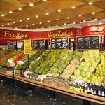 | sección | s., f. | 部门，部分 | Nosotros estamos comprando en la sección de frutas y verduras del supermercado. | departamento | |
| 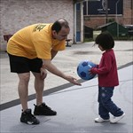 | devolver | v., tr. | 归还，退货 | El niño devuelve el balón al chico que está jugando a fútbol. | retornar, reembolsar (aplicado a dinero) | retener, quedarse |
|  | tarjeta | s., f. | 卡 | Esta persona tiene muchas tarjetas de crédito. | | |
|  | cheque | s., m. | 支票 | Él va al banco a cobrar un cheque por su trabajo. | talón | |
|  | electrodoméstico | s., m. | 电子产品 | En esta tienda venden electrodomésticos de color rosa. | | |
|  | preocupado | adj., m. | 担心的 | Ella está preocupada por los resultados de sus exámenes. | | |
|  | buscar | v., tr. | 寻找 | La chica busca una calle en el mapa. | | |
| 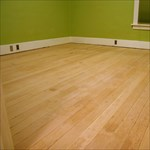 | madera | s., f. | 木材 | El suelo de la casa es de madera. | | |
| 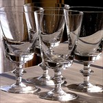 | cristal | s., m. | 玻璃，水晶 | Estas copas de cristal brillan mucho con el sol. | vidrio | |
|  | propietario | s., m. | 主人，房东 | Juan es el propietario de Mad. | dueño, amo | |
| 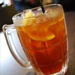 | bebida | s., f. | 饮料 | El té con limón es una de las bebidas más refrescantes del verano. | líquido | |
| 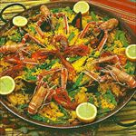 | ración | s., f. | 部分 | Esta paella es de 4-5 raciones. | porción | |
| 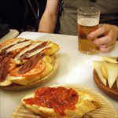 | tapa | s., f. | 餐前小吃 | El chico toma una cerveza y unas tapas en el bar. | aperitivo | |
| 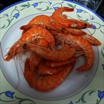 | gamba | s., f. | 虾 | Me encanta comer gambas a la plancha. | | |
| 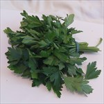 | perejil | s., m. | 西芹 | El cocinero utiliza el perejil en muchos platos. | | |
| 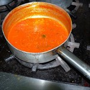 | salsa | s., f. | 酱汁 | Yo estoy preparando la salsa para la pasta. | | |
| 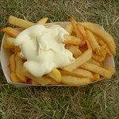 | mayonesa | s., f. | 蛋黄酱 | Me gusta poner mayonesa a las patatas fritas. | mahonesa | |
| 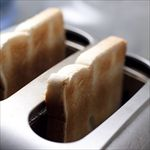 | tostada | s., f. | 烤面包 | Normalmente desayuno tostadas con mermelada. | | |
|  | compartir | v., tr. | 分享，公用 | Las chicas comparten el paraguas. | repartir | |
| 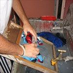 | lavar | v., tr. | 洗 | El hombre lava la ropa a mano. | limpiar | |
|  | amable | adj., m./f. | 有礼貌的，举止得体的 | La mujer y el hombre son muy amables con la señora mayor. | sociable, simpático | antipático, desagradable, grosero |
| 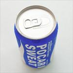 | lata | s., f. | 易拉罐 | La lata está cerrada. | bote | |
| 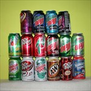 | refresco | s., m. | 软饮料 | Nosotros hemos comprado muchos refrescos. | | |
| 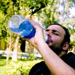 | sed | s., f. | 渴 | Joaquín tiene mucha sed. | | |
| 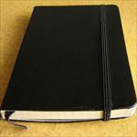 | cuaderno | s., m. | 笔记本 | Mi cuaderno nuevo es de color negro. | libreta | |
| 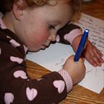 | redacción | s., f. | 作文 | La niña está acabando su redacción. | composición, escrito | |
| 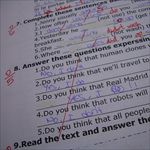 | suspender | v., tr. | 不及格 | María ha suspendido el examen de inglés. | | aprobar |
|  | aprobar | v., tr. | 通过，及格 | Jorge ha aprobado su examen de lengua con un 6.5. | pasar | suspender |
| 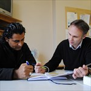 | repasar | v., tr. | 复习 | Pedro y Raúl repasan juntos los temas para el examen de Sociología. | revisar | |
| 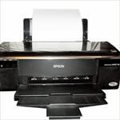 | impresora | s., f. | 打印机 | En mi oficina tenemos una impresora. | | |
|  | fotocopiadora | s., f. | 影印机，复印机 | Esta fotocopiadora es muy completa y profesional. | | |
| 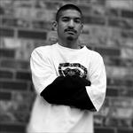 | reservado | adj., m. | 矜持的 | Antonio es un chico muy reservado, no conocemos nada de su vida. | discreto, callado | indiscreto, hablador |
|  | presentarse | v., tr. | 介绍 | Lorena presenta a Juan y Olga. | | |
|  | apellidarse | v., tr. | 姓 | Este chico se apellida Martínez. | | |
| 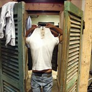 | probador | s., m. | 尝试，测试 | El chico se prueba una camiseta en el probador de la tienda. | | |
|  | sombrero | s., m. | 帽子 | El modelo lleva un sombrero gris y negro. | gorro | |
|  | ropa | s., f. | 衣服 | Nosotros estamos de compras en una tienda de ropa. | prenda, atuendo | |
|  | triste | adj., m./f. | 伤心，不开心 | Hoy estoy un poco triste. | | alegre, contento, feliz |
|  | cansado | adj., m. | 困的，累的 | El bebé está muy cansado y necesita dormir. | fatigado, agotado | fresco, descansado |
|  | enfadado | adj., m. |生气的，难过的 | Mi hijo Luis está enfadado porque no vamos al zoo. | enojado, cabreado | contento |
|  | cara | s., f. | 脸 | La chica tiene la cara maquillada. | tez, rostro | |
| 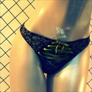 | bragas | s., f. | 内裤 | Estoy pensando en comprar unas bragas nuevas. | | |
| 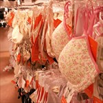 | sujetador | s., m. | 胸罩 | Estoy pensando en comprar un sujetador. | sostén | |
| 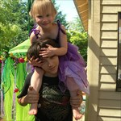 | tolerante | adj., m./f. | 容忍的，宽容的 | El primo de Irina es muy tolerante con ella: no se molesta cuando juega con él. | transigente, respetuoso, paciente | intransigente |
|  | tranquilo | adj., m. | 安静的 | Este oso panda es muy tranquilo, siempre está descansando. | | |
|  | abierto | adj., m. | 开朗的 | El bebé es muy abierto: siempre sonríe a la gente. | extrovertido | cerrado, introvertido |
|  | pañuelo | s., m. | 方巾 | La mujer lleva un pañuelo de seda en color claro. | chal, fular, foulard (voz francesa) | |
| 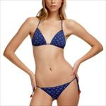 | biquini | s., f. | 比基尼 | La modelo lleva un biquini de color azul. | bikini | |
|  | pescadería | s., f. | 鱼店 | El chico está pensando qué va a comprar en la pescadería. | | |
|  | zapatería | s., f. | 鞋店 | Los zapatos de esta zapatería están tirados por el suelo. | | |
|  | frutería | s., f. | 水果店 | En esta frutería tienen mucha fruta. | | |
|  | joyería | s., f. | 珠宝店 | Esta joyería tiene joyas muy caras. | | |
|  | dedo | s., m. | 手指，脚趾 | Los niños levantan sus dedos pulgares. | | |
|  | mano | s., f. | 手 | En la imagen se ve la radiografía de una mano. | garra, zarpa (en animales) | |
|  | pulsera | s., f. | 手镯 | La niña lleva una pulsera muy original. | | |
|  | bebé | s., m. | 婴儿 | La madre da un beso a su bebé. | | |
|  | morir | v., intr. | 死亡 | En el cementerio se encuentran las personas que han muerto. | fallecer | nacer, vivir |
|  | nacer | v., intr. | 出生 | El bebé acaba de nacer. | | morir, fallecer |
|  | adolescente | sust./adj., m./f. | 青年 | Estas tres adolescentes van a la misma clase en el instituto. | joven | niño, adulto |
|  | doler | v., intr. | 疼，痛 | Al niño le duelen los dientes. | | |
|  | mareado | adj., m. | 头晕的 | La niña comienza a estar mareada después de tantas vueltas. | | |
|  | alergia | s., f. | 过敏的 | Arturo tiene alergia a algunas plantas. | | |
|  | sueño | s., m. | 梦 | El gato de Roberto tiene sueño. | | |
|  | tos | s., f. | 咳嗽 | El niño tiene bastante tos. | carraspeo | |
|  | jarabe | s., m. | 糖浆 | La madre da un jarabe para la tos a su hija. | | |
|  | dibujar | v., tr. | 画画 | A Juan le encanta dibujar con muchos colores. | delinear | |
|  | don de gentes | sust., m. | 交际能力 | Para ser un buen político es necesario tener don de gentes. | sociabilidad | |
|  | memorizar | v., tr. | 记住 | Estrella tiene que memorizar muchos conceptos para su examen. | recordar | olvidar |
|  | estatua | s., f. | 雕像 | La estatua de la Libertad es un símbolo de la ciudad de Nueva York. | efigie, escultura, imagen, figura | |
|  | vista panorámica | s., f. | 全景图 | Me gusta fotografiar la vista panorámica de cada ciudad a la que viajo. | | |
|  | maestro | s., m. | 老师 | La maestra de informática ayuda a una estudiante. | profesor, instructor | alumno, discípulo |
|  | academia | s., f. | 学校，学院 | Hoy comienzan las inscripciones en la academia de baile. | escuela | |
|  | violín | s., m. | 小提琴 | Rosa toca el violín. | | |
|  | instrumento | s., m. | 乐器 | En la tienda de música venden muchos instrumentos diferentes. | | |
|  | flamenco | s., m. | 弗拉门戈 | Cuando voy a Sevilla, voy a un espectáculo de flamenco. | | |
|  | tutor | s., m. | 导师，家教 | El tutor explica a Ricardo qué tiene que estudiar. | maestro, profesor | |
|  | ser el ojo(ojito) derecho | expr. coloq. | 掌上明珠 | Mario es el ojito derecho de su padre porque siempre juega mucho con él. | | |
|  | orquesta | s., f. | 管弦乐队 | Rosa toca el violín en una orquesta. | banda | |
|  | enseñar | v., tr. | 教学 | El profesor está enseñando lengua china a sus alumnos extranjeros. | explicar | |
|  | brazo | s., m. | 胳膊 | El chico ejercita sus brazos en el gimnasio. | | |
|  | oído | s., m. | 听力，内耳 | El médico explica las partes del oído. | | |
|  | guitarra | s., f. | 吉他 | Cuando tengo tiempo, toco la guitarra. | | |
|  | piano | s., m. | 钢琴 | Mireia está aprendiendo a tocar el piano en una academia de música. | | |
|  | músico | s., m. | 音乐家 | Niccolò Paganini es un músico italiano, especializado en tocar el violín. | | |
|  | poesía | s., f. | 诗人 | Esta poesía está escrita en portugués. | | |
|  | diablo | s., m. | 魔鬼 | Homer no sabe si escuchar al ángel o al diablo. | demonio | ángel |
|  | cuerda | s., f. | 弦 | Este instrumento musical tiene 8 cuerdas. | | |
|  | partitura | s., f. | 乐谱 | El músico mira la partitura para tocar. | | |
|  | guión | s., m. | 剧本 | Los actores leen el guión antes de comenzar. | | |
|  | garganta | s., f. | 喉咙 | A Luis le duele mucho la garganta. | | |
|  | tratamiento | s., m. | 治疗 | Ana recibe un tratamiento para su enfermedad. | medicación | |
|  | completar | v., tr. | 完成 | Jorge está completando el formulario. | rellenar, terminar | |
|  | agenda | s., f. | 日程表，日志 | Yo llevo la agenda siempre en el bolso. | | |
|  | archivador | s., m. | 文档 | Guardo mis contratos de trabajo en un archivador. | carpeta, clasificador | |
|  | facultad | s., f. | 系，学院 | Pedro estudia en la facultad de Ciencias de la Información. | escuela | |
|  | apuntes | s., m. | 笔记 | Ana tiene todos los apuntes de la lección de hoy. | notas | |
|  | negocio | s., m. | 商店 | Mi tía tiene un negocio de zapaterías. | | |
|  | parque de atracciones | s., m. | 游乐园 | A los niños les encanta ir al parque de atracciones. | | |
|  | vértigo | s., m. | 头晕 | Muchas personas tienen vértigo en lugares altos. | | |
|  | pierna | s., f. | 腿 | Las chicas caminan por la playa mostrando sus piernas. | pata (animales) | |
|  | temblar | v., intr. | 战栗，发抖 | El chico está temblando de frío. | vibrar | |
|  | pasear | v., intr. | 散步 | Belén pasea con su gato por el jardín. | caminar, andar, dar una vuelta | |
|  | centro histórico | s., m. | 历史中心 | Mi casa está en el centro histórico de México DF. | | |
|  | propina | s., f. | 小费 | Ellos han dejado 10 céntimos de propina. | extra, prima (para deportes), gratificación | |
|  | carta | s., f. | 菜单 | En la carta de este restaurante hay carnes y pescados. | menú | |
|  | cuenta | s., f. | 账单 | La cuenta del bar es de 50,10€. | nota | |
|  | salmón | s., m. | 大马哈鱼 | El salmón se utiliza para preparar sushi. | | |
|  | merluza | s., f. | 鳕鱼 | A mí me gusta mucho comer merluza al horno. | | |
|  | jamón york | s., m. | 火腿 | Yo estoy en la carnicería comprando jamón york. | | |
|  | funcionario | s., m. | 公务员 | Los bomberos son un grupo de funcionarios. | | |
|  | candidato | s., m. | 候选人 | Barack Obama fue candidato del Partido Demócrata en el año 2008. | aspirante, postulante (en América) | |
|  | demanda | s., f. | 要求，需求 | Algunas personas hacen una demanda de empleo en la calle. | | oferta (laboral) |
|  | requisito | s., m. | 条件 | Un requisito para este trabajo es hablar inglés. | obligación | |
|  | práctica | s., f. | 实践，练习 | Irina es estudiante de periodismo y está de prácticas en una televisión local. | prueba | |
|  | factura | s., f. | 帐单，发票 | En esta factura hay muchos servicios y productos. | recibo, nota | |
|  | cazadora | s., f. | 猎装, 夹克 | Roberto lleva una cazadora negra para ir con la moto. | chupa (coloquial) | |
|  | guantes | s., m. | 手套 | Cuando hace mucho frío, utilizo guantes. | | |
|  | dientes | s., m. | 牙齿 | La chica tiene unos dientes perfectos. | | |
|  | lengua | s., f. | 舌头 | La niña saca la lengua. | | |
|  | colonia | s., f. | 花露水 | Ana se pone su colonia favorita. | perfume, esencia | |
|  | alumno | s., m. | 学生 | Estos niños son alumnos de la misma escuela. | estudiante | |
|  | matemáticas | s., f. | 数学 | El niño utiliza la calculadora para su clase de matemáticas. | | |
|  | maletín | s., m. | 手提包 | El profesor lleva los exámenes en el maletín. | | |
|  | azafata | s., f. | 空姐 | La azafata nos saluda cuando entramos al avión. | | |
|  | uniforme | s., m. | 制服 | Este es el uniforme que llevan los policías que vigilan la plaza de Tian'anmen. | | |
|  | diploma | s., m. | 证书，学位，文凭 | El presidente entrega un diploma a otro político. | certificado, título | |
|  | congreso | s., m. | 代表大会 | Esta semana se celebra un congreso de arquitectos. | asamblea, reunión, convención, seminario, conferencia | |
